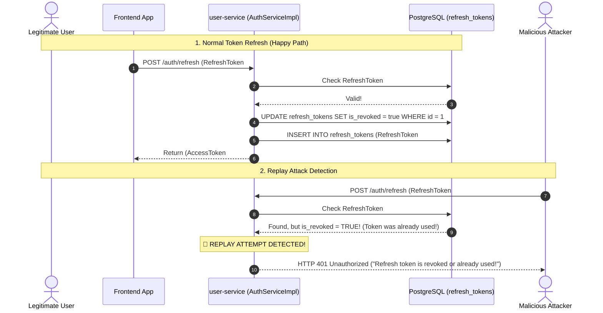

# Master Guide & Deep Dive: User & Identity Microservice (`user-service`)

> **An in-depth, interview-ready textbook explaining how `user-service` works in and out, mastering stateless security concepts, the Spring Security 6 filter chain, JJWT 0.12.6, and the complete HTTP request lifecycle.**

---

## 1. The Core Philosophy: Stateless Architecture in Microservices

### 1.1 Stateful vs. Stateless Architecture

In traditional monolithic web applications (e.g. standard Spring MVC with JSP/Thymeleaf), authentication is **stateful**:

```
[ Client ] ---(1) POST /login (username/password) ---> [ Server Instance 1 ]
[ Client ] <--(2) Set-Cookie: JSESSIONID=abc1234 ----- [ Stores session in RAM ]

[ Client ] ---(3) GET /orders (Cookie: JSESSIONID) --> [ Server Instance 2 ] (Load Balanced)
                                                       ❌ "Who are you? Session abc1234 not found in my RAM!"
```

#### The Problem with Stateful Sessions in Microservices:
1. **No Horizontal Scaling:** If you deploy 5 instances of `user-service` behind an AWS ALB or Kubernetes ingress, a user whose session was saved in Instance 1's RAM will fail authentication if their next request hits Instance 2.
2. **Sticky Sessions or Redis Clustering Required:** To fix this in stateful apps, you must force the load balancer to route the user to the same instance ("sticky sessions"), which destroys load balancing efficiency, or replicate sessions to a shared Redis cluster (adding latency and complexity).

---

### 1.2 How Stateless Architecture Solves This

In our **stateless microservice architecture**:

```
[ Client ] ---(1) POST /auth/login (email/password) ---> [ Any Server Instance ]
[ Client ] <--(2) { "accessToken": "eyJhbGciOi...",     [ Stores ZERO state in server RAM ]
                    "refreshToken": "eyJhbGciOi..." }

[ Client ] ---(3) GET /users/me (Header: Bearer eyJ...) -> [ Any Other Server Instance ]
                                                        ✅ "I validated your signature with my secret key!
                                                           You are user 42 with role ROLE_USER!"
```

- **Zero Memory Allocation for Sessions:** The server stores **no session data** in JVM memory.
- **Cryptographically Self-Contained:** The token itself contains the user ID, email, roles, and expiration.
- **Infinite Scalability:** You can spin up 100 instances of `user-service`. Any instance can verify the cryptographic signature of the token independently in fractions of a millisecond without querying any shared session cache!

---

## 2. Anatomy of a JSON Web Token (JWT)

A JWT is a string composed of three distinct parts separated by dots (`.`):

$$\text{JWT} = \text{Header} . \text{Payload (Claims)} . \text{Signature}$$

### Part 1: Header (Base64Url Encoded)
Describes the cryptographic algorithm and the type of token:
```json
{
  "alg": "HS256",
  "typ": "JWT"
}
```

### Part 2: Payload / Claims (Base64Url Encoded)
Contains the actual statement of truth (claims) about the user:
```json
{
  "sub": "animesh@example.com",
  "iat": 1726214400,
  "exp": 1726215300,
  "id": "c1f7a2d4-3b1a-4d7e-9f8a-2c5b3e1a7f9d",
  "roles": ["ROLE_USER"]
}
```
- `sub` (Subject): The user identifier (email).
- `iat` (Issued At): Unix epoch timestamp when token was created.
- `exp` (Expiration): Unix epoch timestamp when token expires (15 mins for access token).
- `id` (custom token identifier): Unique UUID used by this application to track refresh-token records. It is not the registered JWT `jti` claim.
- `roles`: Custom claim containing user's security authorities.

### Part 3: Signature
Calculated using the server's private secret key:
$$\text{Signature} = \text{HMAC-SHA256}(\text{Base64Url}(\text{Header}) + "." + \text{Base64Url}(\text{Payload}), \text{SecretKey})$$

> [!IMPORTANT]
> **Why Tampering Fails:** If an attacker decodes the payload, changes `"roles": ["ROLE_USER"]` to `"roles": ["ROLE_ADMIN"]`, and sends it to the server, the server recalculates the signature using its secret key. Because the payload changed, the recalculated signature will NOT match the third segment of the token. The server instantly rejects the token with a `SignatureException`!

---

## 3. End-to-End Request Lifecycle & Security Filter Pipeline

Here is the exact step-by-step journey of an HTTP request entering `user-service`:

```
Client
  │
  ▼ [HTTP Request: GET /api/users/me with "Authorization: Bearer <jwt>"]
[Embedded Tomcat Web Server (Port 8081)]
  │
  ▼
[Standard Servlet Filters]
  │
  ▼
[DelegatingFilterProxy] (Spring bridge bean inside web.xml / servlet container)
  │
  ▼
[FilterChainProxy] (Spring Security's master pipeline controller)
  │
  ├── 1. CorsFilter (Validates Origin against allowed patterns)
  ├── 2. HeaderWriterFilter (Injects security response headers: X-Content-Type-Options, etc.)
  ├── 3. LogoutFilter
  │
  ├── 4. AuthTokenFilter (OUR CUSTOM FILTER!)
  │      ├── Extracts "Authorization" header
  │      ├── Strips "Bearer " prefix
  │      ├── Calls JwtUtils.validateToken()
  │      │     └── Checks HMAC signature & expiration timestamp
  │      ├── Extracts email ("sub")
  │      ├── Calls UserDetailsServiceImpl.loadUserByUsername(email)
  │      │     └── Queries PostgreSQL for user & roles
  │      ├── Creates UsernamePasswordAuthenticationToken(userDetails, null, authorities)
  │      ├── Stores it in ThreadLocal: SecurityContextHolder.getContext().setAuthentication(...)
  │      └── Sets request attribute: request.setAttribute("user-id", userDetails.getId())
  │
  ├── 5. UsernamePasswordAuthenticationFilter (Skipped because request is already authenticated)
  ├── 6. RequestCacheAwareFilter
  ├── 7. SecurityContextHolderAwareRequestFilter
  ├── 8. AnonymousAuthenticationFilter (Only fires if SecurityContext was still empty)
  │
  ├── 9. ExceptionTranslationFilter
  │      └── Catches AccessDeniedException or InsufficientAuthenticationException
  │          and routes to our AuthEntryPointJwt (returns 401 JSON)
  │
  └── 10. AuthorizationFilter (Enforces .requestMatchers("/auth/**").permitAll(), etc.)
         └── Checks if SecurityContext has required authentication.
             - If authenticated: ALLOW!
             - If unauthenticated: DENY (triggers Step 9)!
  │
  ▼
[DispatcherServlet] (Spring MVC Front Controller)
  │
  ▼
[HandlerMapping] (Finds UserController.getCurrentUser())
  │
  ▼
[HandlerAdapter] (Resolves @AuthenticationPrincipal from SecurityContextHolder)
  │
  ▼
[UserController.getCurrentUser()]
  │
  ▼
[UserServiceImpl.getUserById()]
  │
  ▼
[UserRepository.findById()] -> [PostgreSQL (user_db)]
  │
  ▼
[Returns GenericResponse.success(UserResponseDto)] -> [Jackson Serializes to JSON] -> [HTTP 200 to Client]
```

---

## 4. The Token Lifecycle & Refresh Token Rotation

### 4.1 Why Two Tokens (Access vs. Refresh)?
- **Access Token (15-Minute Expiry):**
  - Carried on every single HTTP request.
  - Short-lived so that if an attacker intercepts it on public Wi-Fi, the window of vulnerability is very small.
  - Stateless: Server does NOT query database to verify it; verification is pure math (HMAC check).
- **Refresh Token (7-Day Expiry):**
  - Never sent on regular API calls. Sent ONLY to `POST /api/auth/refresh`.
  - Used strictly to generate a new Access Token when the old one expires.
  - Semi-stateful: Its custom `id` claim is saved in the `refresh_tokens` database table.

---

### 4.2 How Refresh Token Rotation Detects Replay Attempts



---

## 5. File-by-File Breakdown: Concept, Purpose & Line Mechanics

### 5.1 `SecurityConfiguration.java`
- **Location:** `com.ecommerce.user.security`
- **Design Pattern:** Chain of Responsibility (Servlet Filter Pipeline), Strategy Pattern.
- **Key Concepts:**
  - `@EnableWebSecurity`: Activates Spring Security's HTTP filter chain.
  - `@EnableMethodSecurity`: Enables `@PreAuthorize("hasRole('ADMIN')")` on methods.
  - `SessionCreationPolicy.STATELESS`: Forbids creating HTTP sessions in RAM.
  - `addFilterBefore(authTokenFilter, UsernamePasswordAuthenticationFilter.class)`: Ensures our JWT filter inspects the request header before Spring checks username/password.
  - `BCryptPasswordEncoder(12)`: Computes $2^{12} = 4,096$ hashing iterations with cryptographically random salt.

### 5.2 `AuthTokenFilter.java`
- **Location:** `com.ecommerce.user.security.jwt`
- **Design Pattern:** Interceptor Pattern (`OncePerRequestFilter`).
- **Key Concepts:**
  - `OncePerRequestFilter`: Guarantees exactly one execution per request thread even with asynchronous servlet dispatches.
  - `authHeader.substring(7)`: Strips `"Bearer "` prefix to obtain the raw cryptographic string.
  - `UsernamePasswordAuthenticationToken(userDetails, null, authorities)`: 3-argument constructor sets `authenticated = true`.
  - `SecurityContextHolder.getContext().setAuthentication(...)`: Stores authentication in JVM `ThreadLocal` memory for the current request thread.
  - `handlerExceptionResolver.resolveException(...)`: Bridges servlet filter exceptions directly to `@RestControllerAdvice`.

### 5.3 `JwtUtils.java`
- **Location:** `com.ecommerce.user.security.jwt`
- **Design Pattern:** Utility Bean (Stateless Component).
- **Key Concepts:**
  - `Decoders.BASE64.decode(base64Secret)`: Converts Base64 text string into raw binary bytes.
  - `Keys.hmacShaKeyFor(keyBytes)`: Produces a type-safe `SecretKey` object.
  - `Jwts.SIG.HS256`: Modern JJWT 0.12.6 signature algorithm constant.
  - `Jwts.parser().verifyWith(secretKey).build().parseSignedClaims(token)`: Validates signature and parses payload claims in one atomic operation.

### 5.4 `AuthEntryPointJwt.java`
- **Location:** `com.ecommerce.user.security.jwt`
- **Design Pattern:** Strategy Pattern (`AuthenticationEntryPoint`).
- **Key Concepts:**
  - Invoked when an unauthenticated request attempts to reach a protected endpoint.
  - Sets HTTP status to `401 Unauthorized` and `Content-Type: application/json`.
  - Writes `GenericResponse.error(null, authException.getMessage())` directly to `response.getOutputStream()`.

### 5.5 `UserDetailsImpl.java` & `UserDetailsServiceImpl.java`
- **Location:** `com.ecommerce.user.security.services`
- **Design Pattern:** Adapter Pattern (`UserDetailsImpl`), Service Pattern (`UserDetailsServiceImpl`).
- **Key Concepts:**
  - Separates JPA entity (`User`) from Spring Security framework contract (`UserDetails`).
  - `@Primary`: Guarantees Spring injects our database-backed user loader rather than any default in-memory auto-configuration.
  - `@Transactional(readOnly = true)`: Prevents `LazyInitializationException` and skips Hibernate dirty-checking overhead.

### 5.6 `AuthServiceImpl.java`
- **Location:** `com.ecommerce.user.service.impl`
- **Design Pattern:** Service Layer Pattern, Facade Pattern.
- **Key Concepts:**
  - `authenticationManager.authenticate()`: Coordinates authentication across registered providers.
  - Refresh Token Rotation: Invalidates used refresh token and issues newly minted access and refresh tokens.
  - Password Reset Session Limitation: When a user resets their password, `refreshTokenRepository.revokeAllByUserEmail()` blocks future token refreshes. Existing access tokens remain valid until their normal expiry, so this is not immediate access-token revocation.

### 5.7 `GenericResponse.java`
- **Location:** `com.ecommerce.user.utils`
- **Design Pattern:** Response Envelope Pattern, Builder Pattern.
- **Key Concepts:**
  - Guarantees every single endpoint returns `{ success: boolean, message: string, data: T }`.
  - Static factory methods: `GenericResponse.success(data)` and `GenericResponse.error(data, message)`.

### 5.8 `GlobalExceptionHandler.java`
- **Location:** `com.ecommerce.user.exception`
- **Design Pattern:** Aspect-Oriented Programming (AOP), Exception Translation.
- **Key Concepts:**
  - `@RestControllerAdvice`: Intercepts exceptions from all controllers and serializes return values directly to JSON.
  - Translates `BadCredentialsException` $\rightarrow$ 401 Unauthorized.
  - Translates `MethodArgumentNotValidException` $\rightarrow$ 400 Bad Request with field-level validation message.
  - Translates `EntityExistsException` $\rightarrow$ 400 Bad Request.

---

## 6. Tricky Interview Masterclass Q&A for `user-service`

### Q1: Where does Spring Security store authentication details during a request, and how is it thread-safe?
**Answer:**
Spring Security uses `SecurityContextHolder`, which delegates to a `ThreadLocal` strategy (`MODE_THREADLOCAL`) by default. Because each incoming HTTP request in Tomcat is handled by an independent worker thread, the authentication object is completely isolated to that thread. When the request finishes, the `SecurityContextPersistenceFilter` / `SecurityContextHolderFilter` clears the ThreadLocal to prevent data leaks when Tomcat returns the thread to the worker pool.

### Q2: If JWT is stateless, how do you handle user logout or forced password reset?
**Answer:**
Pure stateless JWTs cannot be revoked before expiration without server-side tracking. We solve this through two mechanisms:
1. **Short Access Token Lifespan (15 mins):** Limits the exposure window.
2. **Refresh-token identifier allow-list:** Each refresh token has a UUID in this application's custom `id` claim, and active refresh-token identifiers are tracked in the `refresh_tokens` database table. Password reset revokes stored refresh tokens, blocking future refreshes; this version has no logout endpoint and does not block already-issued access tokens. An API-gateway Redis access-token blocklist is planned for a later phase.

### Q3: What is the N+1 query problem when loading a User and their Roles?
**Answer:**
If `User.roles` is configured with `FetchType.LAZY`, calling `user.getRoles()` can trigger a separate `SELECT` query for each user. If you fetch 50 users, that can become 1 query for users + 50 role queries = 51 queries (N+1). This service currently uses `FetchType.EAGER` to make roles available during authentication; EAGER does not guarantee one SQL join or eliminate N+1 for collection queries. Use `JOIN FETCH` or `@EntityGraph` on a specific repository query when one joined fetch is required.

---

## 7. Complete Annotations Masterclass: How They Work Internally & How They Differ

### 7.1 How Annotations Work Under the Hood
1. **Reflection:** At startup, Spring scans `.class` files using `java.lang.reflect` and creates in-memory `BeanDefinition` metadata.
2. **Dynamic Proxies (AOP):** For annotations like `@Transactional`, `@PreAuthorize`, or `@Async`, Spring does not invoke your class directly. It wraps your class in a **CGLIB proxy** or **JDK dynamic proxy** to intercept execution, start transactions, or evaluate roles.

### 7.2 Core Stereotype Annotations Compared
| Annotation | Target | Purpose | Behavioral Distinction |
|---|---|---|---|
| **`@Component`** | Class | Generic Spring bean | Parent stereotype. Used on utilities and filters. |
| **`@Service`** | Class | Domain business logic | Identical to `@Component`, but designates the business logic tier and enables AOP service pointcuts. |
| **`@Repository`** | Class/Interface | Data access layer | **Unique feature:** Activates `PersistenceExceptionTranslationPostProcessor` to translate vendor SQL exceptions into Spring's `DataAccessException` hierarchy! |
| **`@Configuration`** | Class | Bean definition factory | **Unique feature:** Enhanced via **CGLIB proxies** to enforce singleton semantics. Calling a `@Bean` method from another `@Bean` method returns the existing container singleton, NOT a new object! |

### 7.3 `@Bean` vs. `@Component`
- Use **`@Component`** on classes you own and can annotate directly (e.g. `AuthTokenFilter`, `JwtUtils`).
- Use **`@Bean`** on methods inside `@Configuration` classes when instantiating third-party classes you cannot edit (e.g. `BCryptPasswordEncoder`, `ObjectMapper`, `OpenAPI`).

### 7.4 Security Annotations: `@EnableWebSecurity` vs. `@EnableMethodSecurity`
- **`@EnableWebSecurity`:** Operates at the **HTTP Servlet Web Layer** (before any controller method). Manages the `SecurityFilterChain`, URL matchers, headers, CORS, and CSRF.
- **`@EnableMethodSecurity`:** Operates at the **Java Method Layer** via Spring AOP proxies. Enables `@PreAuthorize("hasRole('ADMIN')")` directly on controller/service methods.

### 7.5 Web Annotations: `@RestController` vs. `@Controller`
- **`@Controller`:** Returns a String view name resolved by ViewResolvers (JSP/Thymeleaf).
- **`@RestController`:** Meta-annotation combining `@Controller` + `@ResponseBody`. Return values are converted directly into JSON via Jackson (`MappingJackson2HttpMessageConverter`).

### 7.6 JPA Annotations: `@Entity` vs. `@Table`
- **`@Entity`:** Tells Hibernate that the class maps to a database row managed by the `EntityManager`.
- **`@Table(name = "users")`:** Specifies the actual SQL table name. Necessary because PostgreSQL reserves `"user"` as a keyword!

### 7.7 Transactions: `@Transactional` vs. `@Transactional(readOnly = true)`
- **`@Transactional`:** Opens transaction, enables dirty-checking snapshots, commits on success, rollbacks on unchecked exceptions.
- **`@Transactional(readOnly = true)`:** Signals a read-only transaction and can reduce Hibernate dirty-checking work. It does not by itself route queries to read replicas; that requires datasource-routing infrastructure.

### 7.8 Lombok Annotations (Compile-Time AST Manipulation)
- **`@RequiredArgsConstructor`:** Generates constructor for all `final` fields at compile time, enabling clean **Constructor Dependency Injection**.
- **`@Getter` / `@Setter`:** Generates getters/setters in bytecode, removing boilerplate.
- **`@Builder`:** Implements GoF Builder Pattern for fluent object creation.
- **`@Slf4j`:** Generates an SLF4J Logger instance automatically.
